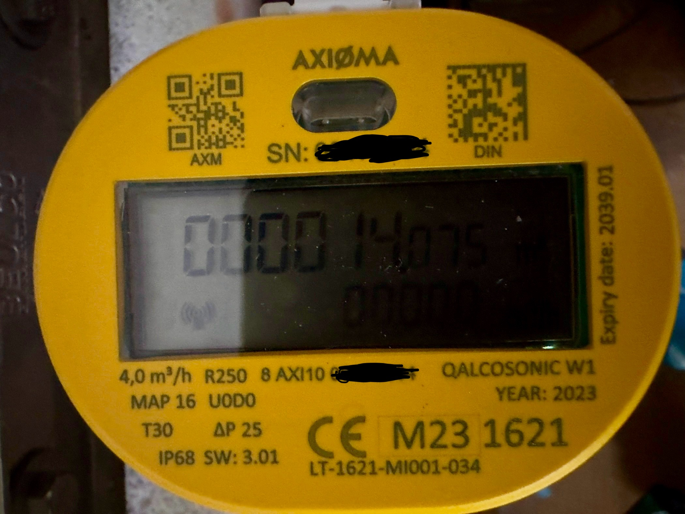

# axioma-meters
I've recently had an Axioma smart watermeter of type Qalcosonic W1 installed at my house and want to find out how to get the readings remotely. The utilities company is not willing to give me access to the meter nor do they have a web frontend nor any API available for accessing the data. It's unclear if they can even access the meter remotely at the moment.
<figure>
  
  <figcaption>Photo of the Axioma Qalcosonic W1 smart ultrasonic water meter</figcaption>
</figure>

## Axioma meters
The Lithuanian company [Axioma](https://www.axiomametering.com/en) produces several types of smart meters:
- Ultrasonic water meters (W1, F1)
- Ultrasonic heat and cooling meters (E3, E4)
- older systems that are discontinued as of November 2023

For now I am only looking at the W1 as that is the one installed at my place.

## Qalcosonic W1
The Axioma meters come with different radio interfaces:
- wireless MBUS (868 MHz)
- LoRaWAN
- NB-IoT (LTE subset)
- NFC for configuration and reading
- IR interface (technically not a radio interface, but allows for remote reading and parametrization like the NFC interface).

### Reading and Parametrization
All the following information can be gathered on the Web through searching. Axioma also has a [support system](https://axmsupport.freshdesk.com/support/login) where you can [create an account](https://axmsupport.freshdesk.com/support/signup) and access their [knowledge base](https://axmsupport.freshdesk.com/support/solutions). The knowledge base itself has valuable information, alas not for what I need for this project. I've opened a support ticket with them and will keep things updated here.

**Update 20231106:** they basically told me that end users will not be provided any information by them directly, read: go away, we won't talk to you. 

The smart meter can be configured by a web interface and an optical accessory with a USB plug (the OG-1 USB, ridiculously priced at around 200€/USD) as well as through an Android App that is not available on the Play Store anymore, but can be found on the Web. The Android phone with the app installed connects to the smart meter through NFC. Axioma provides manuals on how to configure the meter.
Basically parametrization means that you can activate and deactivate the radio interfaces and set certain configuration settings for each. 

The optical interface seems to use the MBUS protocol, and probably consists of a D0 interface. The serial speed seems to be 2400 bit/s but I'm not yet sure about the other serial parameters. The system needs to be woken up by a 1 second pulse. 

## Goals
The goals of this project are:
- understanding the optical interface to build an optical head with cheap items and design a 3D printable frame that anchors around the outside of the meter, allows for the display to be read while at the same time reading the values from the data logger in the device and sending them to an MQTT broker.
- possibly allow the configuration of the radio interfaces

### Optical Head
*tbd*

### Circuitry
- ESP32/NodeMCU/Wemos D1 based: cheap micro controllers, available with WiFi and an abundance of IO-Pins as well as an I^2^C and an SPI interface. Possibly [esphome](https://esphome.io) (and [on github](https://github.com/esphome/esphome)) based
- IR photo transistor and IR LED (not yet sure which wavelength, but probably around 850-880nm).

### 3D printable frame
*tbd*
